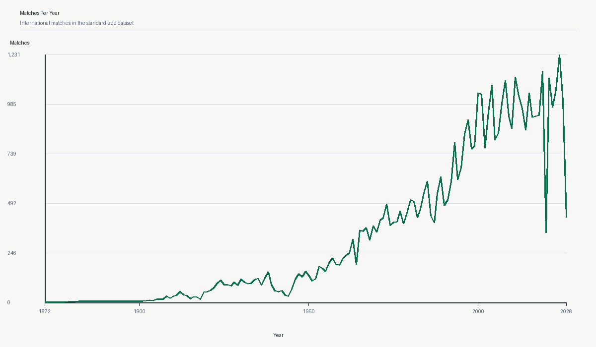
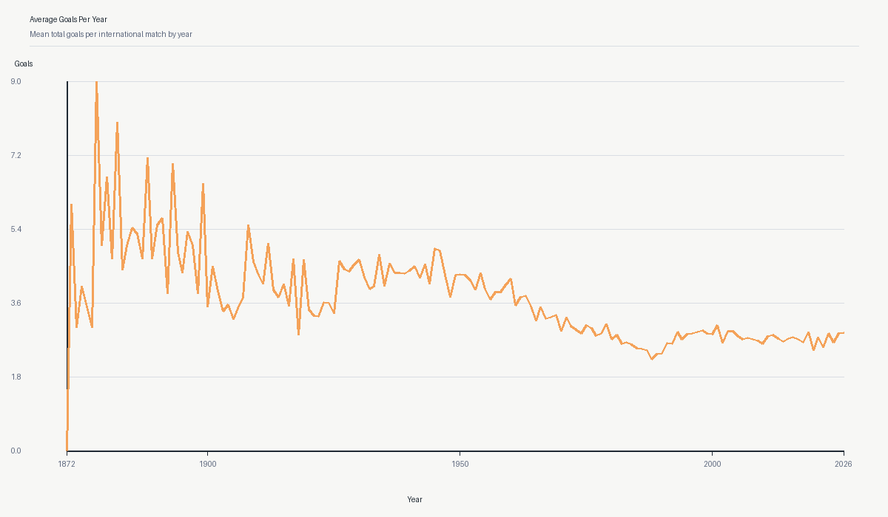
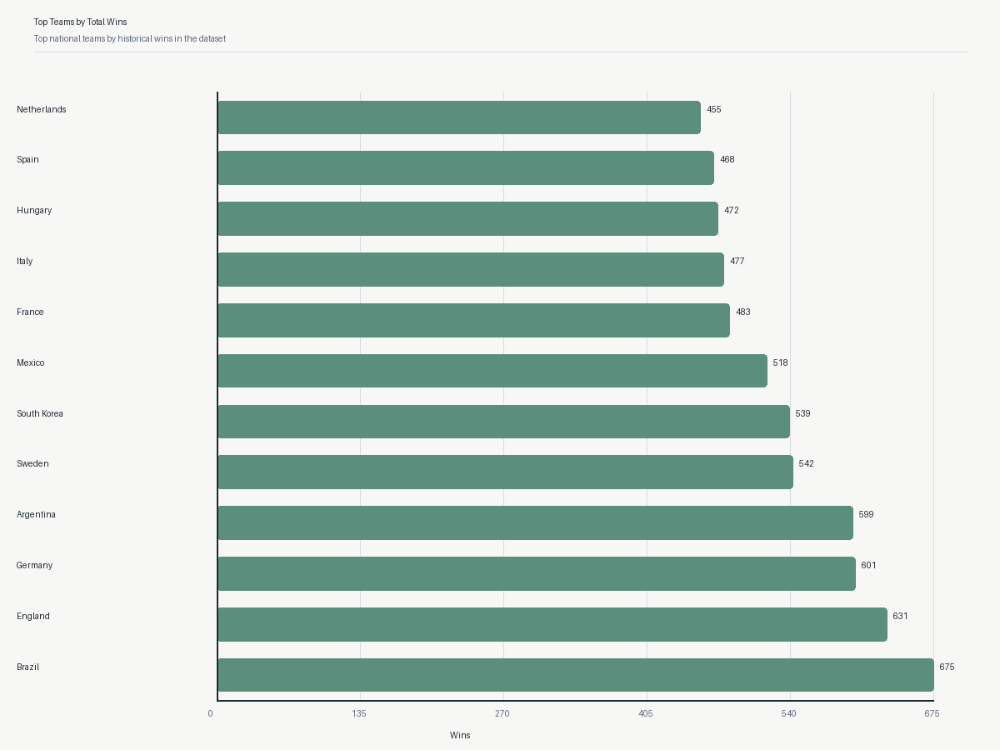
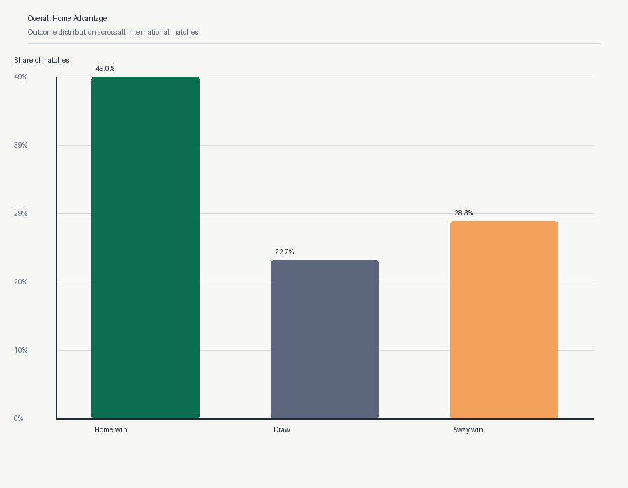
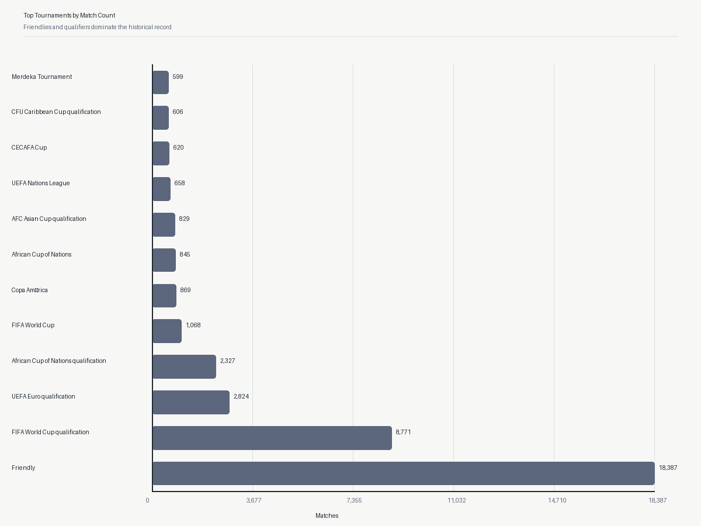

# World Cup 2026 Analytics

World Cup 2026 Analytics is a portfolio project about historical international football results and reproducible sports analytics. The project follows the full analytical path from raw CSV validation to PostgreSQL loading, SQL analysis, notebook-based exploration, and an interactive Streamlit dashboard. It is designed to be understandable for a junior data analyst while still showing a realistic end-to-end workflow. The current version uses real match data and presents actual computed findings from the project dataset.

---

## Features

- Data validation
- Data profiling
- Data transformation
- PostgreSQL loading
- SQL analytics
- Python EDA
- Jupyter Notebook
- Streamlit Dashboard

---

## Dataset

- Source: `results.csv` from the `martj42/international_results` repository
- Data type: historical international men's national-team football matches
- Period: `1872-11-30` to `2026-07-19`
- Matches: `49,520`
- Teams: `337`
- Tournaments: `201`
- Host countries: `269`

The analytical layer first tries to read data from the PostgreSQL table `matches`. If PostgreSQL is unavailable, the notebook and dashboard fall back to `data/interim/matches_standardized.csv`.

---

## Project Structure

```text
world-cup-2026-analytics/
|-- README.md
|-- pyproject.toml
|-- .gitignore
|-- .env.example
|-- Makefile
|-- config/
|   |-- column_mapping.example.toml
|   `-- column_mapping.toml
|-- data/
|   |-- raw/
|   |-- interim/
|   |-- processed/
|   `-- sample/
|-- dashboard/
|   |-- app.py
|   |-- data.py
|   `-- charts.py
|-- docs/
|   |-- images/
|   |-- data_contract.md
|   |-- data_sources.md
|   |-- dataset_selection.md
|   |-- transformation_rules.md
|   `-- database_setup.md
|-- notebooks/
|   `-- world_cup_analysis.ipynb
|-- reports/
|   |-- data_profiles/
|   |-- figures/
|   |-- transformations/
|   `-- sql_analysis.md
|-- sql/
|   |-- analysis/
|   |-- ddl/
|   `-- queries/
|-- src/
|   `-- world_cup_analytics/
|       |-- analysis/
|       |-- data/
|       |-- database/
|       |-- features/
|       |-- visualization/
|       |-- cli.py
|       |-- config.py
|       `-- __init__.py
`-- tests/
```

---

## Technologies

- Python
- PostgreSQL
- SQL
- Pandas
- Matplotlib
- Plotly
- SQLAlchemy
- Pytest
- Streamlit

---

## Installation

1. Clone the repository.

```bash
git clone <your-repository-url>
cd world-cup-2026-analytics
```

2. Create and activate a virtual environment.

```bash
python -m venv .venv
```

Windows PowerShell:

```bash
.venv\Scripts\Activate.ps1
```

3. Install project dependencies.

```bash
pip install -e .[dev]
```

4. Create a local environment file.

```bash
copy .env.example .env
```

Then fill in PostgreSQL connection values in `.env`. Do not commit this file.

5. Place the original `results.csv` file into `data/raw/`.

6. Validate, profile, and standardize the dataset.

```bash
wca-validate-data data/raw/results.csv
wca-profile-data data/raw/results.csv
wca-transform-data data/raw/results.csv --mapping config/column_mapping.toml --output data/interim/matches_standardized.csv
```

7. Load the standardized file into PostgreSQL.

```bash
wca-load-postgres data/interim/matches_standardized.csv
```

---

## Usage

Check local configuration:

```bash
wca-check-config
```

Load standardized matches into PostgreSQL:

```bash
wca-load-postgres data/interim/matches_standardized.csv
```

Run an analytical SQL script:

```bash
psql -d world_cup_analytics -f sql/analysis/03_home_advantage.sql
```

Open the analytical notebook:

```bash
jupyter notebook notebooks/world_cup_analysis.ipynb
```

Run the Streamlit dashboard:

```bash
streamlit run dashboard/app.py
```

Dashboard tabs:

- `Overview`: KPI cards, match volume, outcomes, and short findings
- `Trends`: yearly trends with optional 5-year and 10-year rolling smoothing
- `Teams`: team-level KPI, yearly results, common opponents, and last matches
- `Tournaments`: tournament overview, top teams, yearly dynamics, and biggest wins
- `Home Advantage`: non-neutral versus neutral comparisons
- `Match Explorer`: filtered match table with CSV export

The notebook and dashboard try PostgreSQL first and then fall back to `data/interim/matches_standardized.csv` if the database is unavailable.

---

## Main Findings

- The final dataset contains `49,520` international matches across more than 150 years of football history.
- Match volume grew dramatically over time and reached a peak of `1,231` matches in `2024`.
- Home advantage is clearly visible: in non-neutral matches, home teams win `50.75%` of the time versus `26.40%` for away teams.
- Brazil leads the historical ranking by total wins with `675` victories, ahead of England, Germany, and Argentina.
- Friendly matches dominate the data by volume with `18,387` matches, so the full dataset reflects regular international scheduling more than only major finals.
- The dataset contains `9` matches with scores above `20`, which should be treated as historical outliers for review rather than automatically removed.

---

## Screenshots

### Matches Per Year



### Average Goals Per Year



### Top Teams by Wins



### Home Advantage



### Top Tournaments



---

## Future Work

- Add rolling-form features for teams before each match.
- Compare competitive matches and friendlies in more detail.
- Build a simple interpretable baseline model for match outcome probabilities.
- Extend the Streamlit dashboard with a deployment-ready public presentation layer.

---

## License

TODO: choose and add a repository license before public release.
